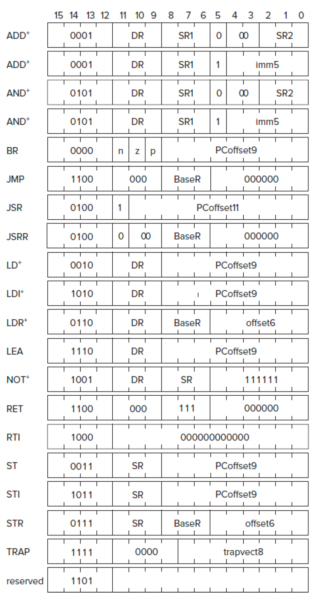

# Архитектура
  * Разярдность: 16 бит
  * Регистры общего назаначения: R0, R1, R2, R3, R4, R5, R6, R7
  * Регистры специального назначения
    * PC (Program Counter) — счетчик команд
    * COND (Condition) - состояние посленего условия
  * Память: 2^16 = 65536 (0x0000 – 0xFFFF) слов, каждое слово = 16 бит
  * Порядок байт: Big-endian (старший байт идет первым)
  * Размер инструкций: 16 бит (фиксированная длина)

# Охват инструкций

### Сделано
  - [x] BR
  - [x] ADD
  - [x] LD
  - [x] ST
  - [x] JSR
  - [x] AND
  - [x] LDR
  - [x] STR
  - [ ] RTI
  - [x] NOT
  - [x] LDI
  - [x] STI
  - [x] JMP
  - [x] RES
  - [x] LEA
  - [x] TRAP

### TRAP
  - [x] GETC
  - [x] OUT
  - [x] PUTS
  - [ ] TIN
  - [ ] PUTSP
  - [x] HALT
  - [ ] INU16
  - [ ] OUTU16

# Ассемблер
## Описание директив
  * `.ORIG` - Указывает начальный адрес программы.
  * `.FILL` - Заполняет одну ячейку памяти указанным значением.
  * `.BLKW` - Резервирует блок памяти заданного размера.
  * `.STRINGZ` - Сохраняет строку символов в памяти, завершая её нулевым символом (NUL).
  * `.END` - Обозначает конец программ

# Инстуркции

### BR
 * Синтаксис: `BR[n][z][p] offset9`
 * Описание: Выполняет условный переход по смещению `offset9`, если соответствующие флаги (n – отрицательное, z – ноль, p – положительное) установлены.

### ADD
 * Синтаксис: `ADD DR, SR1, SR2` или `ADD DR, SR1, imm5`
 * Описание: Складывает содержимое регистра `SR1` с содержимым регистра `SR2` или с непосредственным значением `imm5`, результат сохраняется в `DR`. Обновляет условный флаг.

### LD
 * Синтаксис: `LD DR, offset9`
 * Описание: Загружает слово из памяти по адресу, вычисляемому как PC + offset9, и помещает его в DR. Обновляет условный флаг.

### ST
 * Синтаксис: `ST SR, offset9`
 * Описание: Сохраняет слово из регистра SR в память по адресу, вычисляемому как PC + offset9.

### JSR
 * Синтаксис: `JSR offset11` или `JSRR BaseR`
 * Описание: Выполняет переход к подпрограмме. В режиме JSR сохраняется адрес возврата в R7, и переход осуществляется по адресу PC + offset11; в режиме JSRR адрес перехода берётся из регистра BaseR.

### AND
 * Синтаксис: `AND DR, SR1, SR2` или `AND DR, SR1, imm5`
 * Описание: Выполняет побитовое логическое И между содержимым регистра SR1 и содержимым регистра SR2 или между SR1 и непосредственным значением imm5, результат сохраняется в DR. Обновляет условный флаг.

### LDR
 * Синтаксис: `LDR DR, BaseR, offset6`
 * Описание: Загружает слово из памяти по адресу, вычисляемому как (BaseR + offset6), и помещает его в DR. Обновляет условный флаг.

### STR
 * Синтаксис: `STR SR, BaseR, offset6`
 * Описание: Сохраняет слово из регистра SR в память по адресу, вычисляемому как (BaseR + offset6).

### RTI
 * Синтаксис: `RTI`
 * Описание: Возвращает управление из режима прерывания, восстанавливая предыдущее состояние процессора. Используется в системах с поддержкой прерываний.

### NOT
 * Синтаксис: `NOT DR, SR`
 * Описание: Выполняет побитовое отрицание (комплемент) содержимого регистра SR и сохраняет результат в DR. Обновляет условный флаг.

### LDI
 * Синтаксис: `LDI DR, offset9`
 * Описание: Косвенно загружает слово: сначала вычисляется адрес как PC + offset9, затем по этому адресу считывается указатель, и по полученному адресу загружается искомое слово в DR. Обновляет условный флаг.

###  STI
 * Синтаксис: `STI SR, offset9`
 * Описание: Косвенно сохраняет слово: сначала вычисляется адрес как PC + offset9, затем по этому адресу считывается указатель, и по полученному адресу сохраняется содержимое регистра SR.

### JMP
 * Синтаксис: `JMP BaseR`
 * Описание: Безусловно переходит по адресу, содержащемуся в регистре BaseR.

### RES
 * Синтаксис: `RES`
 * Описание: Зарезервирована для будущего использования. В спецификации LC‑3 не определена; инструкция должна игнорироваться.

### RET
 * Синтаксис: `RET`
 * Описание: Возвращает управление из подпрограммы, выполняя безусловный переход по адресу, хранящемуся в R7. Эквивалентно JMP R7.

### LEA
 * Синтаксис: `LEA DR, offset9`
 * Описание: Загружает адрес (PC + offset9) в регистр DR, не обращаясь к памяти по этому адресу. Обновляет условный флаг.

### TRAP
 * Синтаксис: TRAP trapvect8
 * Описание: Вызывает системный вызов, переходя к обработчику по адресу, заданному в trap-векторе (8 бит). Примеры: TRAP x25 (HALT), TRAP x21 (OUT), TRAP x22 (PUTS) и т.д.
